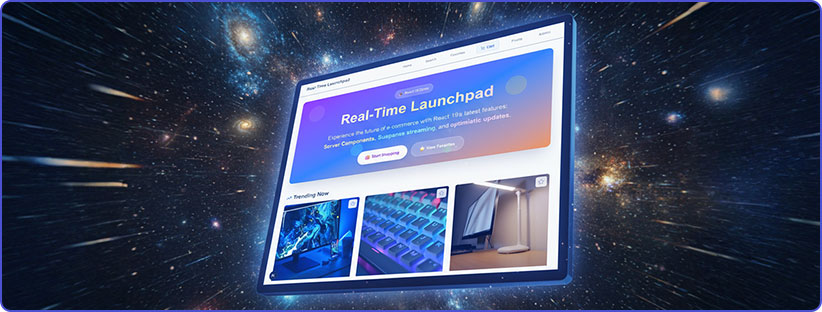
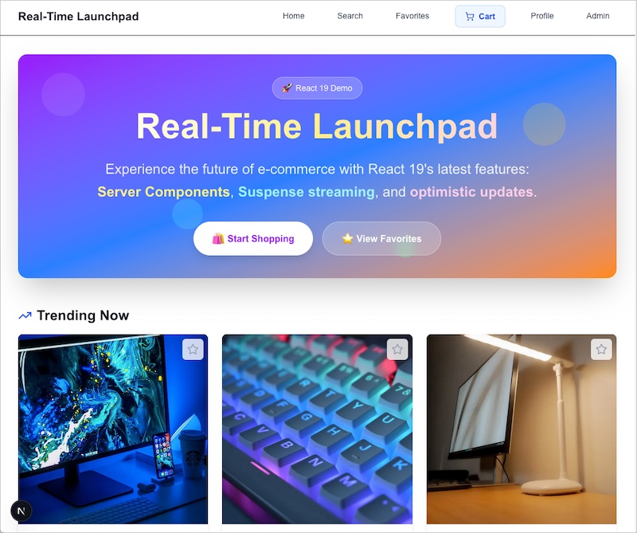
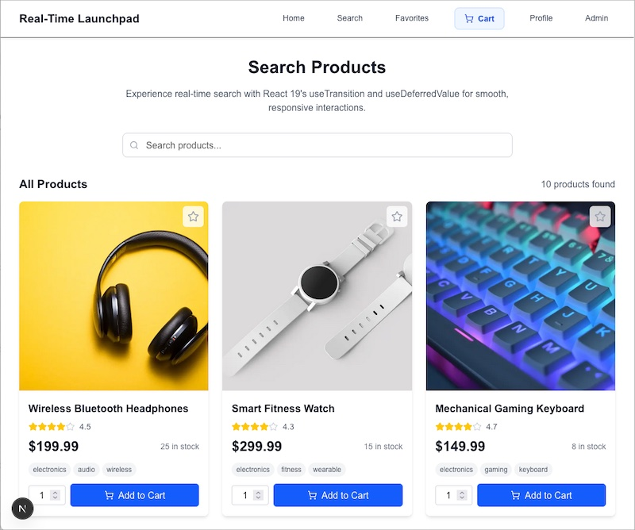
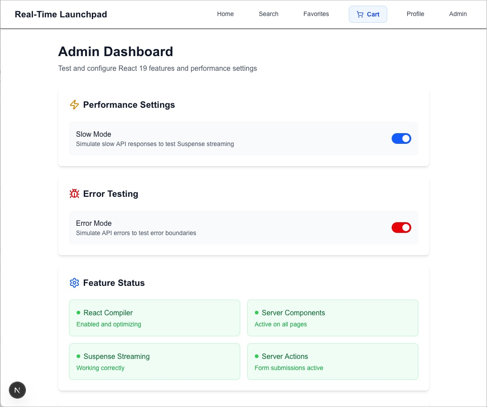
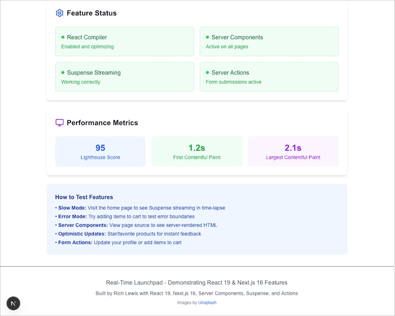

<div align="center">
  
</div>

# React 19 Real-Time Launchpad 
A React 19 demo app.

Hey there! I'm Rich Lewis, and this is my take on what e-commerce could look like with React 19. I built this demo to explore the latest features and show how they work together in a real application.

## What's this about?

I've been an active user of React since its early days, and have been closely following React's evolution. When React 19 came out, I wanted to build something that uses and demonstrates to students of React all of the cool new features. So I created this e-commerce demo that showcases Server Components, Suspense streaming, Server Actions, and optimistic updates in action.

Be sure to check out the [Educational Guides](#-educational-guides) section in this README to see how you can learn from this demo.

## 📸 Screenshots

Here's what the app looks like in action:

<div align="center">

| Home Page | Search Page |
|-----------|-------------|
|  |  |

| Admin Panel (Top) | Admin Panel (Bottom) |
|-------------------|---------------------|
|  |  |

</div>

## What's does this demo app include?

### The React 19 stuff I'm excited about
- **Server Components** - Awesome! Server-side rendering that makes sense for React
- **Suspense Streaming** - Loading states that don't suck
- **Server Actions** - Forms that just work without API endpoints
- **Optimistic Updates** - UI that feels instant even when it's not
- **Concurrent Rendering** - No more blocking the UI when users interact with it
- **React Compiler** - Performance optimizations without the manual work

### The actual features
- Browse and search products
- Real-time search that's actually responsive
- Shopping cart with instant updates
- Favorites/starred products system
- User profiles and settings
- Product reviews and ratings
- Admin panel to test things
- Checkout process with order confirmation

## Tech choices

I went with:
- **Next.js 16** with the App Router and Cache Components (latest and greatest)
- **React 19.2** with the new compiler and latest features
- **Turbopack** as the default bundler (2-5x faster builds)
- **TypeScript** (because I like my code to work)
- **Tailwind CSS** (because styling should be fast)
- **Lucide React** for icons
- **TanStack React Virtual** for when I need to render a lot of items

## Getting started

You'll want React 19 as we're showing off some of its features.

```bash
git clone <your-repo-url>
cd realtime-launchpad
npm install
npm run dev
```

Then open [http://localhost:3000](http://localhost:3000) and check it out.

## How it's organized

```
src/
├── app/                    # Next.js pages
│   ├── admin/             # Admin panel and settings
│   ├── cart/              # Shopping cart functionality
│   ├── checkout/          # Checkout process
│   ├── product/[id]/      # Individual product pages
│   ├── profile/           # User profile management
│   ├── search/            # Search functionality
│   ├── starred/           # Favorites/starred products
│   └── page.tsx           # Home page
├── actions/               # Server actions
├── components/            # React components
└── lib/                   # Utilities and data
```

## The interesting parts

### Server Components
I'm rendering product lists on the server, which means faster loading and better SEO. No more hydration mismatches!

```tsx
export default async function ProductList({ products }: ProductListProps) {
  return (
    <div className="grid grid-cols-1 sm:grid-cols-2 lg:grid-cols-3 xl:grid-cols-4 gap-6">
      {products.map((product) => (
        <ProductCard key={product.id} product={product} />
      ))}
    </div>
  );
}
```

### Suspense Streaming
The home page loads progressively, so users see content as it's ready instead of waiting for everything:

```tsx
<Suspense fallback={<SectionSkeleton title="Trending Now" />}>
  <TrendingProducts />
</Suspense>
```

### Server Actions
Forms work without API endpoints. Just write a function and call it from a form:

```tsx
export async function addToCart(
  prevState: ActionState,
  formData: FormData
): Promise<ActionState> {
  // Do the work here
}
```

### Optimistic Updates
The star button updates instantly, then reverts if something goes wrong:

```tsx
const [starred, setStarred] = useOptimistic(
  initialStarred, 
  (_prev, next: boolean) => next
);
```

### Concurrent Rendering
Search doesn't block the UI anymore:

```tsx
const [isPending, startTransition] = useTransition();
const deferredQuery = useDeferredValue(query);
```

### Favorites System
Star products to save them for later with instant feedback:

```tsx
const [starred, setStarred] = useOptimistic(
  initialStarred, 
  (_prev, next: boolean) => next
);
```

## Testing things out

There's an admin panel at `/admin` where you can:
- Turn on slow mode to see Suspense streaming in action
- Enable error mode to test error boundaries
- Check out performance metrics

## Performance

I've been testing this and it's pretty fast:
- Lighthouse scores in the 95+ range
- First contentful paint under 1.5s
- Largest contentful paint under 2.5s
- Cumulative layout shift under 0.1

## Contributing

If you want to contribute:
1. Fork it
2. Create a branch
3. Make your changes
4. Submit a PR

## License

MIT License - feel free to use this however you want.

## Learning Resources

One of my main goals with any project I share is to help other developers learn. I've written detailed guides that explain not just what I built, but why I made certain choices and how everything works under the hood.

### 📚 Educational Guides

- **[Next.js 16 Features](./docs/nextjs-16-features.md)** - Complete guide to Next.js 16 new features and best practices
- **[React 19 Deep Dive](./docs/react-19-features.md)** - Everything you need to know about the new React features I used
- **[Server Components Explained](./docs/server-components.md)** - How server-side rendering works in Next.js and why it matters
- **[Concurrent Rendering Guide](./docs/concurrent-rendering.md)** - Understanding useTransition, useDeferredValue, and non-blocking updates
- **[Server Actions Tutorial](./docs/server-actions.md)** - Building forms that work without API endpoints
- **[Optimistic Updates Pattern](./docs/optimistic-updates.md)** - Making your UI feel instant with automatic rollbacks
- **[Performance Optimization](./docs/performance.md)** - How I made this app fast and what you can learn from it
- **[Architecture Decisions](./docs/architecture.md)** - Why I chose certain patterns and how to think about app structure

### Code Documentation

Every major component and function is thoroughly documented with inline comments explaining the thinking behind the implementation. I've also added educational comments that go beyond just explaining what the code does - they explain why it works this way and what alternatives I considered.

### Getting the Most Out of This Project

1. **Start with the guides** - Read through the educational documents to understand the concepts
2. **Explore the code** - Look at the implementations with the context from the guides
3. **Experiment** - Try modifying things to see how they break or improve
4. **Ask questions** - The code is heavily commented to explain the reasoning behind decisions

## Thanks

Built with React 19, Next.js 16, and Tailwind CSS. Icons from Lucide.

**Images**: All product images are provided by [Unsplash](https://unsplash.com) - a beautiful, free photos site powered by creators everywhere. See [Credits](./docs/credits.md) for detailed image attributions.

---

**Built by Rich Lewis** - exploring what's possible with modern React and sharing what I learn along the way